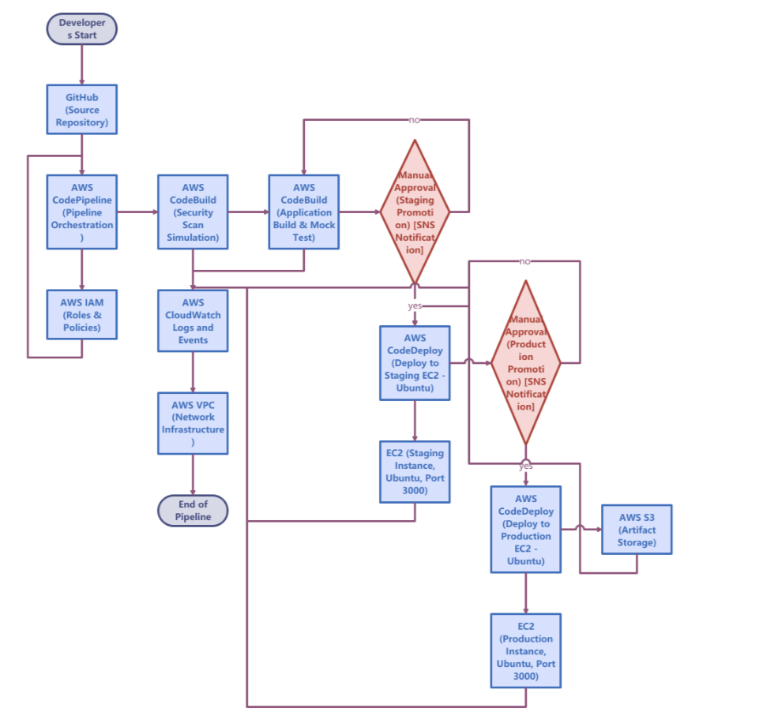
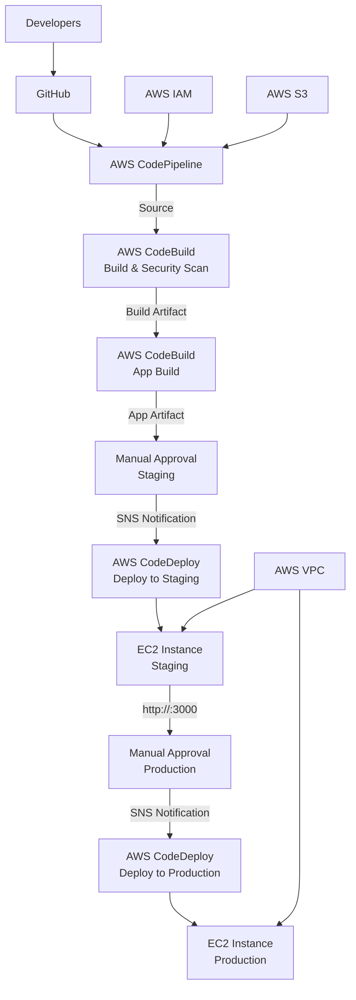
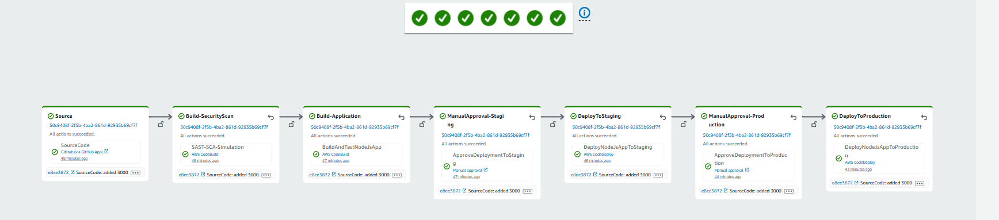
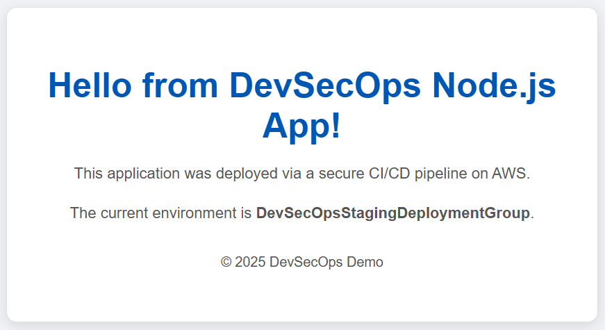
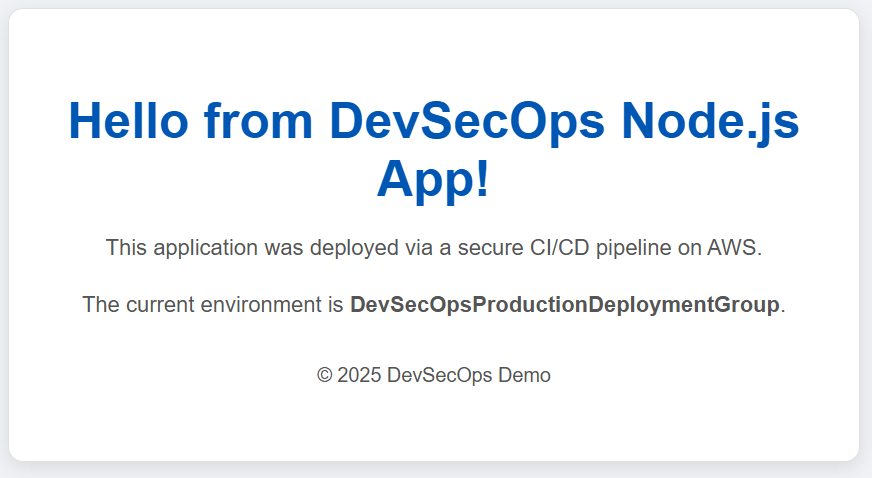
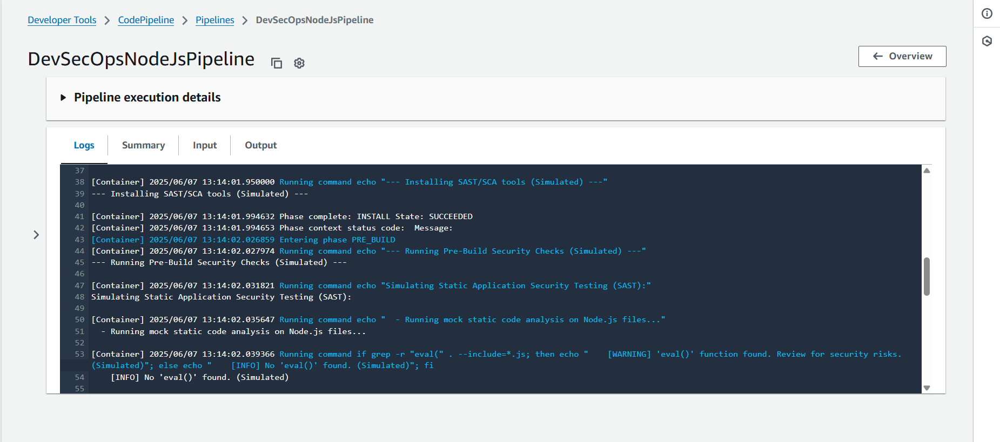
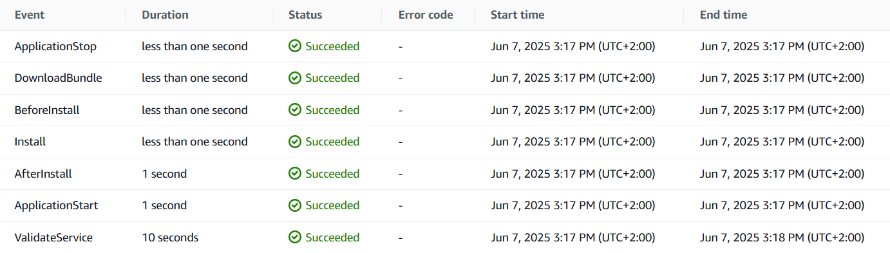

# Serverless DevSecOps CI/CD Pipeline on AWS with Node.js



## Table of Contents
- [Introduction](#introduction)
- [Features & Highlights](#features--highlights)
- [Architecture Overview](#architecture-overview)
- [Application Overview](#application-overview)
- [Challenges Faced & Solutions](#challenges-faced--solutions)
- [Prerequisites](#prerequisites)
- [Deployment Guide](#deployment-guide)
  - [1. Clone the Repository](#1-clone-the-repository)
  - [2. Configure AWS CLI](#2-configure-aws-cli)
  - [3. Create GitHub Connection for CodePipeline](#3-create-github-connection-for-codepipeline)
  - [4. Deploy Core Infrastructure (CloudFormation Stacks)](#4-deploy-core-infrastructure-cloudformation-stacks)
  - [5. Commit and Push Application Code & CodeDeploy Scripts](#5-commit-and-push-application-code--codedeploy-scripts)
  - [6. Trigger and Monitor the Pipeline](#6-trigger-and-monitor-the-pipeline)
- [Verification & Screenshots](#verification--screenshots)
- [Maintaining the Environment & Cost Management](#maintaining-the-environment--cost-management)
- [Cleanup (Crucial for AWS Free Tier)](#cleanup-crucial-for-aws-free-tier)
- [Future Enhancements](#future-enhancements)
- [Author](#author)

## Introduction
This project demonstrates a **robust and automated DevSecOps Continuous Integration/Continuous Delivery (CI/CD) pipeline** built entirely on **AWS CloudFormation** (Infrastructure as Code - IaC) and orchestrated by **AWS CodePipeline**. The pipeline automates the process of taking a Node.js application from a GitHub repository, performing simulated security scans, building the application, and deploying it to dedicated **Staging** and **Production** EC2 instances.

A key focus is adhering to **AWS Free Tier** limits, making it ideal for practical cloud development without significant costs.

## Features & Highlights
- **Automated CI/CD**: Fully automated pipeline using AWS CodePipeline.
- **Infrastructure as Code (IaC)**: CloudFormation templates for repeatability and consistency.
- **DevSecOps Integration (Simulated)**: Simulated SAST/SCA using AWS CodeBuild.
- **Multi-Environment Deployment**: Automated deployment to Staging and Production EC2.
- **Manual Approvals**: Mandatory approval gates for quality control.
- **Node.js Application**: Simple "Hello World" Express.js app on Ubuntu EC2.
- **GitHub Integration**: Seamless integration via Code* Connections.
- **AWS Free Tier Conscious**: Uses t2.micro instances and S3 to minimize costs.
- **Robust Shell Scripting**: CodeDeploy lifecycle hooks for application setup.

## Architecture Overview
The pipeline follows AWS best practices for CI/CD and DevSecOps:

- **Source**: GitHub repository.
- **Orchestration**: AWS CodePipeline.
- **Build & Security Scan**: AWS CodeBuild for building and simulating SAST/SCA.
- **Deployment**: AWS CodeDeploy for in-place deployments.
- **Compute**: Ubuntu t2.micro EC2 instances.
- **Networking**: Amazon VPC, Subnets, Internet Gateway, Security Groups.
- **Identity & Access Management**: IAM roles with least-privilege principles.
- **Notifications**: Amazon SNS for manual approval alerts (optional).
- **Logs**: AWS CloudWatch Logs for monitoring.



## Application Overview
The demo application is a minimal **Node.js Express.js** server listening on port 3000, serving a "Hello World" message indicating the deployment environment (Staging or Production).

- app.js: Main application logic.
- package.json: Project metadata and dependencies.
- .gitignore: Specifies files to ignore in Git.
- scripts/: Contains CodeDeploy lifecycle hook scripts (appspec.yml).

## Challenges Faced & Solutions
- **CloudFormation Dependency Resolution**: Used !Ref and !ImportValue for stack interdependencies.
- **IAM Permissions**: Added specific IAM policies to resolve AccessDenied errors.
- **EC2 UserData**: Migrated to Ubuntu AMI for Node.js installation to fix npm issues.
- **CodeDeploy Permissions**: Fixed EACCES errors by setting ubuntu user ownership in AfterInstall hook.
- **CodeDeploy appspec.yml**: Configured correct deployment destinations and Ec2TagFilters.
- **CodePipeline Artifacts**: Ensured proper OutputArtifactFormat and CodeBuild artifact types.

## Prerequisites
- **AWS Account**: Active with [AWS Free Tier](https://aws.amazon.com/free/).
- **GitHub Account**: Repository for project code.
- **AWS CLI**: Configured with credentials.
```bash
aws configure
```
- **EC2 Key Pair**: Created in [EC2 console](https://console.aws.amazon.com/ec2/). Keep the .pem file secure.

## Deployment Guide
Follow these steps to deploy the pipeline using CloudFormation.

### 1. Clone the Repository
```bash
git clone https://github.com/4Min4m/AWS-env.git
cd AWS-env
```

### 2. Configure AWS CLI
```bash
aws configure
```

### 3. Create GitHub Connection for CodePipeline
- Go to [AWS CodePipeline console](https://console.aws.amazon.com/codepipeline/).
- Navigate to **Settings > Connections > Create connection**.
- Select **GitHub**, name it (e.g., MyGitHubConnection), and authorize.
- Copy the **Connection ARN** (e.g., arn:aws:code*-connections:us-east-1:ACCOUNT_ID:connection/CONNECTION_ID).

### 4. Deploy Core Infrastructure (CloudFormation Stacks)
Replace placeholders: your-key-pair-name, your-github-username, your-repo-name, your-connection-arn.

#### 4.1. Deploy VPC and Public Subnet (vpc.yaml)
```bash
aws cloudformation deploy \
  --template-file vpc.yaml \
  --stack-name DevSecOpsVPCStack \
  --capabilities CAPABILITY_NAMED_IAM
```

#### 4.2. Deploy IAM Roles (iam_roles.yaml)
```bash
aws cloudformation deploy \
  --template-file iam_roles.yaml \
  --stack-name DevSecOpsIAMRoles \
  --capabilities CAPABILITY_NAMED_IAM
```

#### 4.3. Deploy EC2 Instances (ec2_instances.yaml)
Use Ubuntu 22.04 LTS AMI (e.g., ami-0a7d80731ae1b2435).
```bash
aws cloudformation deploy \
  --template-file ec2_instances.yaml \
  --stack-name DevSecOpsEC2Instances \
  --capabilities CAPABILITY_NAMED_IAM \
  --parameter-overrides \
      KeyPairName=your-key-pair-name
```

#### 4.4. Deploy CodeDeploy Application & Deployment Groups (codedeploy.yaml)
```bash
aws cloudformation deploy \
  --template-file codedeploy.yaml \
  --stack-name DevSecOpsCodeDeploy \
  --capabilities CAPABILITY_NAMED_IAM
```

### 5. Commit and Push Application Code & CodeDeploy Scripts
Ensure app.js, package.json, .gitignore, and scripts/ (appspec.yml, before_install.sh, after_install.sh, stop_application.sh, *t_application.sh, validate_service.sh) are configured for Ubuntu.
```bash
git add .
git commit -m "Node.js app and CodeDeploy scripts for Ubuntu deployment"
git push origin main
```

### 6. Trigger and Monitor the Pipeline
Ensure codepipeline.yaml has correct GitHubRepoName, GitHubOwner, GitHubBranch, and GitHubConnectionArn.
```bash
aws cloudformation deploy \
  --template-file codepipeline.yaml \
  --stack-name DevSecOpsNodeJsPipelineStack \
  --capabilities CAPABILITY_NAMED_IAM \
  --parameter-overrides \
      GitHubRepoName=your-repo-name \
      GitHubOwner=your-github-username \
      GitHubBranch=main \
      GitHubConnectionArn=your-connection-arn
```

## Verification & Screenshots
- **Full Pipeline Execution Success**: Screenshot AWS CodePipeline console showing Succeeded statuses.


- **Staging Environment Application**: Visit http://<Staging_EC2_Public_IP>:3000 and screenshot.


- **Production Environment Application**: Visit http://<Production_EC2_Public_IP>:3000 and screenshot.


- **CodeBuild Security Scan Logs**: View CodeBuild logs for Build-SecurityScan and screenshot.


- **CodeDeploy Successful Events**: View CodeDeploy Events for DeployToStaging/DeployToProduction and screenshot.


## Maintaining the Environment & Cost Management
- **EC2 Instances**: Stop DevSecOps-Staging-Instance and DevSecOps-Production-Instance when idle.
- **Billing Alerts**: Set up [AWS Billing Alerts](https://console.aws.amazon.com/billing/).
- **Other Services**: VPC, IAM, SNS, CodePipeline, CodeBuild, CodeDeploy, S3, CloudWatch Logs stay within Free Tier.

## Cleanup (Crucial for AWS Free Tier)
1. **Terminate EC2 Instances**:
   - In [EC2 Console](https://console.aws.amazon.com/ec2/), terminate DevSecOps-Staging-Instance and DevSecOps-Production-Instance.
2. **Delete S3 Bucket**:
   - In [S3 Console](https://console.aws.amazon.com/s3/), empty and delete codepipeline-artifacts-REGION-ACCOUNT_ID.
3. **Delete CloudFormation Stacks**:
```bash
aws cloudformation delete-stack --stack-name DevSecOpsNodeJsPipelineStack
aws cloudformation wait stack-delete-complete --stack-name DevSecOpsNodeJsPipelineStack
aws cloudformation delete-stack --stack-name DevSecOpsCodeDeploy
aws cloudformation wait stack-delete-complete --stack-name DevSecOpsCodeDeploy
aws cloudformation delete-stack --stack-name DevSecOpsEC2Instances
aws cloudformation wait stack-delete-complete --stack-name DevSecOpsEC2Instances
aws cloudformation delete-stack --stack-name DevSecOpsIAMRoles
aws cloudformation wait stack-delete-complete --stack-name DevSecOpsIAMRoles
aws cloudformation delete-stack --stack-name DevSecOpsVPCStack
aws cloudformation wait stack-delete-complete --stack-name DevSecOpsVPCStack
```
4. **Delete Code* Connection**:
   - In [CodePipeline Console](https://console.aws.amazon.com/codepipeline/), delete the GitHub connection.
5. **Delete Other Resources**:
   - **CloudWatch Logs**: Delete /aws/codebuild/DevSecOps... log groups.
   - **CodeBuild Projects**: Delete DevSecOps projects.
   - **SNS Topic**: Delete DevSecOpsApprovalNotification.

## Future Enhancements
- Real Security Tools: Integrate Snyk CLI, SonarScanner for SAST, and OWASP ZAP for DAST.
- Unit/Integration Tests: Add tests for the Node.js app.
- Containerization: Migrate to Docker and Amazon ECS/EKS with Blue/Green deployments.
- Blue/Green Deployments: Implement with ALB and CodeDeploy.
- Infrastructure Testing: Use cfn-lint and cfn-nag for CloudFormation templates.
- Monitoring & Alarms: Add CloudWatch Alarms for health and rollbacks.
- Security Hub & GuardDuty: Integrate security findings.
- Compliance & Governance: Explore AWS Config and AWS Organizations.
- Cost Optimization: Use autoscaling, Spot Instances, or AWS Lambda.


## Author
**Mohammad Amin Amini**

- GitHub: [4Min4m](https://github.com/4Min4m)
- LinkedIn: [Mohammad Amin Amini](https://www.linkedin.com/in/mohammad-amin-amini)