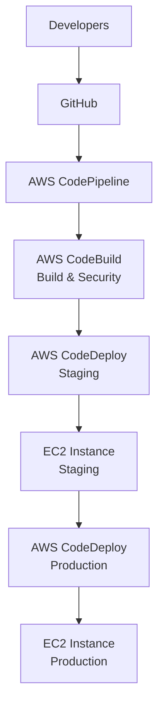

# Serverless DevSecOps CI/CD Pipeline on AWS with Node.js

## Table of Contents
- [Introduction](#introduction)
- [Features](#features)
- [Architecture](#architecture)
- [Prerequisites](#prerequisites)
- [Deployment Guide](#deployment-guide)
- [Verification](#verification)
- [Cleanup](#cleanup)
- [Author](#author)

## Introduction
This project showcases a **DevSecOps CI/CD pipeline** built with **AWS CloudFormation** and orchestrated by **AWS CodePipeline**. It automates the deployment of a Node.js application from a GitHub repository to **Staging** and **Production** EC2 instances, adhering to **AWS Free Tier** limits.

## Features
- **Automated CI/CD**: End-to-end automation with AWS CodePipeline.
- **Infrastructure as Code**: CloudFormation for repeatable AWS resource setup.
- **Security Scans**: Simulated SAST/SCA using AWS CodeBuild.
- **Multi-Environment**: Deploys to separate Staging and Production EC2 instances.
- **Node.js App**: Simple Express.js app on Ubuntu EC2.
- **GitHub Integration**: Uses Code* Connections for source control.
- **Cost-Conscious**: Designed for AWS Free Tier with t2.micro instances.

## Architecture
- **Source**: GitHub repository.
- **Orchestration**: AWS CodePipeline.
- **Build**: AWS CodeBuild for app build and security scans.
- **Deployment**: AWS CodeDeploy for EC2 deployments.
- **Compute**: Ubuntu t2.micro EC2 instances.
- **Networking**: VPC, Subnets, and Security Groups.
- **Logs**: AWS CloudWatch Logs.



## Prerequisites
- **AWS Account**: Active with [AWS Free Tier](https://aws.amazon.com/free/).
- **GitHub Account**: Repository for code.
- **AWS CLI**: Configured with credentials.
```bash
aws configure
```
- **EC2 Key Pair**: Created in [EC2 console](https://console.aws.amazon.com/ec2/).

## Deployment Guide
### 1. Clone Repository
```bash
git clone https://github.com/4Min4m/AWS-env.git
cd AWS-env
```

### 2. Configure AWS CLI
```bash
aws configure
```

### 3. Create GitHub Connection
- Go to [AWS CodePipeline console](https://console.aws.amazon.com/codepipeline/).
- Navigate to **Settings > Connections > Create connection**.
- Select **GitHub**, name it (e.g., MyGitHubConnection), and authorize.
- Copy the **Connection ARN**.

### 4. Deploy CloudFormation Stacks
Replace your-key-pair-name, your-github-username, your-repo-name, and your-connection-arn.
- **VPC** (vpc.yaml):
```bash
aws cloudformation deploy \
  --template-file vpc.yaml \
  --stack-name DevSecOpsVPCStack \
  --capabilities CAPABILITY_NAMED_IAM
```
- **IAM Roles** (iam_roles.yaml):
```bash
aws cloudformation deploy \
  --template-file iam_roles.yaml \
  --stack-name DevSecOpsIAMRoles \
  --capabilities CAPABILITY_NAMED_IAM
```
- **EC2 Instances** (ec2_instances.yaml):
```bash
aws cloudformation deploy \
  --template-file ec2_instances.yaml \
  --stack-name DevSecOpsEC2Instances \
  --capabilities CAPABILITY_NAMED_IAM \
  --parameter-overrides \
      KeyPairName=your-key-pair-name
```
- **CodeDeploy** (codedeploy.yaml):
```bash
aws cloudformation deploy \
  --template-file codedeploy.yaml \
  --stack-name DevSecOpsCodeDeploy \
  --capabilities CAPABILITY_NAMED_IAM
```
- **CodePipeline** (codepipeline.yaml):
```bash
aws cloudformation deploy \
  --template-file codepipeline.yaml \
  --stack-name DevSecOpsNodeJsPipelineStack \
  --capabilities CAPABILITY_NAMED_IAM \
  --parameter-overrides \
      GitHubRepoName=your-repo-name \
      GitHubOwner=your-github-username \
      GitHubBranch=main \
      GitHubConnectionArn=your-connection-arn
```

### 5. Push Code
```bash
git add .
git commit -m "Node.js app and CodeDeploy scripts"
git push origin main
```

## Verification
- **Pipeline Success**: Check AWS CodePipeline console for Succeeded stages.
- **Staging App**: Visit http://<Staging_EC2_Public_IP>:3000.
- **Production App**: Visit http://<Production_EC2_Public_IP>:3000.

## Cleanup
1. **Terminate EC2 Instances**:
   - In [EC2 Console](https://console.aws.amazon.com/ec2/), terminate DevSecOps-Staging-Instance and DevSecOps-Production-Instance.
2. **Delete S3 Bucket**:
   - In [S3 Console](https://console.aws.amazon.com/s3/), empty and delete codepipeline-artifacts-REGION-ACCOUNT_ID.
3. **Delete Stacks**:
```bash
aws cloudformation delete-stack --stack-name DevSecOpsNodeJsPipelineStack
aws cloudformation delete-stack --stack-name DevSecOpsCodeDeploy
aws cloudformation delete-stack --stack-name DevSecOpsEC2Instances
aws cloudformation delete-stack --stack-name DevSecOpsIAMRoles
aws cloudformation delete-stack --stack-name DevSecOpsVPCStack
```

## Author
**Mohammad Amin Amini**

- GitHub: [4Min4m](https://github.com/4Min4m)
- LinkedIn: [Mohammad Amin Amini](https://www.linkedin.com/in/mohammad-amin-amini)